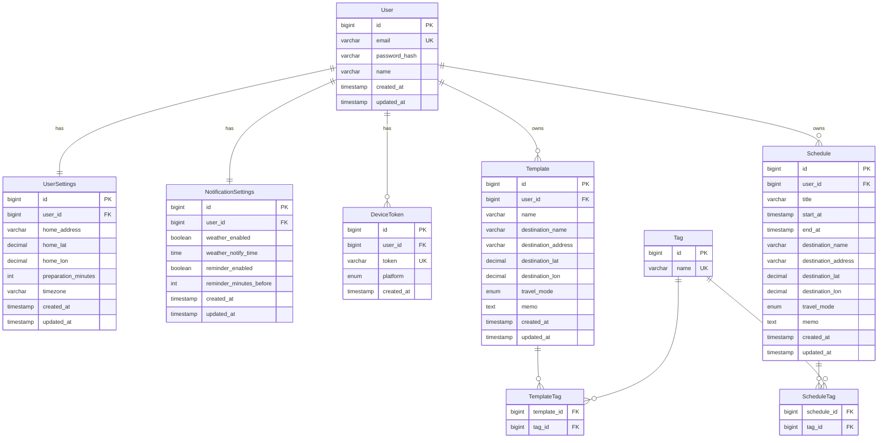

# データモデル草案 / ER図

> `docs/キックオフ.md` と `backend/app/api/api仕様.md` の要件をもとに作成したデータモデル草案です。
> ハッカソンスコープで実装するエンティティとリレーションを定義しています。

---

## エンティティ一覧

### User（ユーザー）

| カラム | 型 | 備考 |
|--------|----|----|
| id | BIGINT PK | |
| email | VARCHAR(255) UNIQUE | ログインID |
| password_hash | VARCHAR | |
| name | VARCHAR(100) | 表示名 |
| created_at | TIMESTAMP | |
| updated_at | TIMESTAMP | |

---

### UserSettings（個人設定）※ User と 1:1

| カラム | 型 | 備考 |
|--------|----|----|
| id | BIGINT PK | |
| user_id | BIGINT FK → User | UNIQUE |
| home_address | VARCHAR(255) | 経路・天気の基点 |
| home_lat | DECIMAL(9,6) | nullable |
| home_lon | DECIMAL(9,6) | nullable |
| preparation_minutes | INT | 身支度時間（分） |
| timezone | VARCHAR(50) | デフォルト: Asia/Tokyo |
| created_at | TIMESTAMP | |
| updated_at | TIMESTAMP | |

**対応エンドポイント:** `GET/PUT /users/me/settings`

---

### Tag（タグマスタ・グローバル）

| カラム | 型 | 備考 |
|--------|----|----|
| id | BIGINT PK | |
| name | VARCHAR(50) UNIQUE | e.g. "デート", "会食"（全ユーザー共通） |

### ScheduleTag（Schedule と Tag の中間テーブル）

| カラム | 型 | 備考 |
|--------|----|----|
| schedule_id | BIGINT FK → Schedule | |
| tag_id | BIGINT FK → Tag | |
| PRIMARY KEY | (schedule_id, tag_id) | |

### TemplateTag（Template と Tag の中間テーブル）

| カラム | 型 | 備考 |
|--------|----|----|
| template_id | BIGINT FK → Template | |
| tag_id | BIGINT FK → Tag | |
| PRIMARY KEY | (template_id, tag_id) | |

---

### Template（テンプレート）

| カラム | 型 | 備考 |
|--------|----|----|
| id | BIGINT PK | |
| user_id | BIGINT FK → User | |
| name | VARCHAR(100) | テンプレート名 |
| destination_name | VARCHAR(255) | nullable |
| destination_address | VARCHAR(255) | nullable |
| destination_lat | DECIMAL(9,6) | nullable |
| destination_lon | DECIMAL(9,6) | nullable |
| travel_mode | ENUM | walking / cycling / transit / driving |
| memo | TEXT | 準備事項 nullable |
| created_at | TIMESTAMP | |
| updated_at | TIMESTAMP | |

**対応エンドポイント:** `GET/POST /templates`, `GET/PUT/DELETE /templates/{id}`, `POST /templates/{id}/apply`

---

### Schedule（予定）

| カラム | 型 | 備考 |
|--------|----|----|
| id | BIGINT PK | |
| user_id | BIGINT FK → User | |
| title | VARCHAR(255) | |
| start_at | TIMESTAMP | 開始日時 |
| end_at | TIMESTAMP | nullable |
| destination_name | VARCHAR(255) | nullable |
| destination_address | VARCHAR(255) | nullable |
| destination_lat | DECIMAL(9,6) | nullable |
| destination_lon | DECIMAL(9,6) | nullable |
| travel_mode | ENUM | walking / cycling / transit / driving |
| memo | TEXT | 準備事項 nullable |
| created_at | TIMESTAMP | |
| updated_at | TIMESTAMP | |

> **設計メモ:** テンプレ適用時はデータをコピーするのみ（`template_id` は持たない）。
> テンプレートを後から編集しても既存の予定に影響しない構成。

**対応エンドポイント:** `GET/POST /schedules`, `GET/PUT/DELETE /schedules/{id}`

---

### NotificationSettings（通知設定）※ User と 1:1

| カラム | 型 | 備考 |
|--------|----|----|
| id | BIGINT PK | |
| user_id | BIGINT FK → User | UNIQUE |
| weather_enabled | BOOLEAN | 天気通知 ON/OFF |
| weather_notify_time | TIME | 毎朝の通知時刻 e.g. 07:00 |
| reminder_enabled | BOOLEAN | 予定リマインダー ON/OFF |
| reminder_minutes_before | INT | 出発X分前に通知 e.g. 30 |
| created_at | TIMESTAMP | |
| updated_at | TIMESTAMP | |

**対応エンドポイント:** `GET/PUT /notifications/settings`

---

### DeviceToken（FCM/APNsトークン）

| カラム | 型 | 備考 |
|--------|----|----|
| id | BIGINT PK | |
| user_id | BIGINT FK → User | |
| token | VARCHAR(512) UNIQUE | FCM/APNsトークン |
| platform | ENUM | ios / android |
| created_at | TIMESTAMP | |

> 1ユーザーが複数端末を持つケースに対応するため別テーブルで管理。

**対応エンドポイント:** `POST /notifications/tokens`, `DELETE /notifications/tokens/{token}`

---

## ER図

---

## 確定した設計判断

| 項目 | 判断 | 理由 |
|------|------|------|
| `template_id` を Schedule に持つか | **持たない** | テンプレ適用はコピーのみ。テンプレ編集が既存予定に波及しない |
| タグ管理 | **Tag + 中間テーブル（ScheduleTag / TemplateTag）** | Schedule と Template を独立して多対多管理 |
| DeviceToken | **別テーブル** | 1ユーザー複数端末を想定 |
| UserSettings | **User と別テーブル（1:1）** | プロフィールと設定を分離し、取得・更新を独立して行えるようにする |
| 天気・経路データ | **DBに保存しない** | BFF として外部API（WeatherAPI.com 等）をリクエスト時に都度呼び出す |
