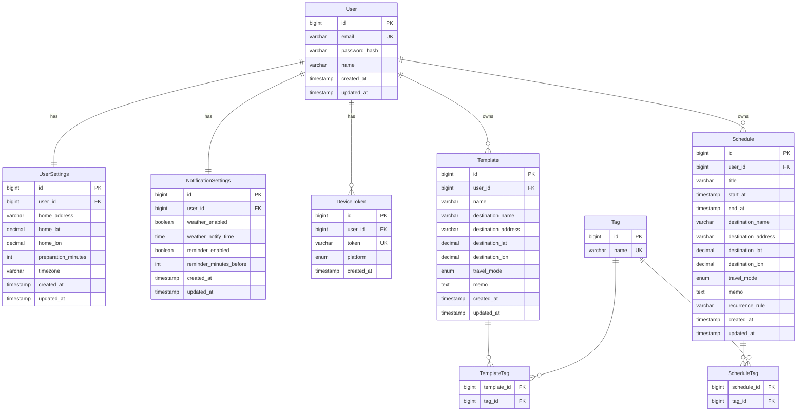

# データモデル草案 / ER図

> `docs/キックオフ.md` と `backend/app/api/api仕様.md` の要件をもとに作成したデータモデル草案です。
> ハッカソンスコープで実装するエンティティとリレーションを定義しています。

---

## エンティティ一覧

### User（ユーザー）

| カラム | 型 | 備考 |
|--------|----|----|
| id | BIGINT PK | |
| email | VARCHAR(255) UNIQUE | ログインID |
| password_hash | VARCHAR | |
| name | VARCHAR(100) | 表示名 |
| created_at | TIMESTAMP | |
| updated_at | TIMESTAMP | |

---

### UserSettings（個人設定）※ User と 1:1

| カラム | 型 | 備考 |
|--------|----|----|
| id | BIGINT PK | |
| user_id | BIGINT FK → User | UNIQUE |
| home_address | VARCHAR(255) | 経路・天気の基点 |
| home_lat | DECIMAL(9,6) | nullable |
| home_lon | DECIMAL(9,6) | nullable |
| preparation_minutes | INT | 身支度時間（分） |
| timezone | VARCHAR(50) | デフォルト: Asia/Tokyo |
| created_at | TIMESTAMP | |
| updated_at | TIMESTAMP | |

**対応エンドポイント:** `GET/PUT /users/me/settings`

---

### Tag（タグマスタ・グローバル）

| カラム | 型 | 備考 |
|--------|----|----|
| id | BIGINT PK | |
| name | VARCHAR(50) UNIQUE | e.g. "デート", "会食"（全ユーザー共通） |

### ScheduleTag（Schedule と Tag の中間テーブル）

| カラム | 型 | 備考 |
|--------|----|----|
| schedule_id | BIGINT FK → Schedule | |
| tag_id | BIGINT FK → Tag | |
| PRIMARY KEY | (schedule_id, tag_id) | |

### TemplateTag（Template と Tag の中間テーブル）

| カラム | 型 | 備考 |
|--------|----|----|
| template_id | BIGINT FK → Template | |
| tag_id | BIGINT FK → Tag | |
| PRIMARY KEY | (template_id, tag_id) | |

---

### Template（テンプレート）

| カラム | 型 | 備考 |
|--------|----|----|
| id | BIGINT PK | |
| user_id | BIGINT FK → User | |
| name | VARCHAR(100) | テンプレート名 |
| destination_name | VARCHAR(255) | nullable |
| destination_address | VARCHAR(255) | nullable |
| destination_lat | DECIMAL(9,6) | nullable |
| destination_lon | DECIMAL(9,6) | nullable |
| travel_mode | ENUM | walking / cycling / transit / driving |
| memo | TEXT | 準備事項 nullable |
| created_at | TIMESTAMP | |
| updated_at | TIMESTAMP | |

**対応エンドポイント:** `GET/POST /templates`, `GET/PUT/DELETE /templates/{id}`, `POST /templates/{id}/apply`

---

### Schedule（予定）

| カラム | 型 | 備考 |
|--------|----|----|
| id | BIGINT PK | |
| user_id | BIGINT FK → User | |
| title | VARCHAR(255) | |
| start_at | TIMESTAMP | 開始日時 |
| end_at | TIMESTAMP | nullable |
| destination_name | VARCHAR(255) | nullable |
| destination_address | VARCHAR(255) | nullable |
| destination_lat | DECIMAL(9,6) | nullable |
| destination_lon | DECIMAL(9,6) | nullable |
| travel_mode | ENUM | nullable, walking / cycling / transit / driving |
| memo | TEXT | 準備事項 nullable |
| recurrence_rule | VARCHAR(500) | nullable, 将来の繰り返し予定用 (RRULE形式) |
| created_at | TIMESTAMP | |
| updated_at | TIMESTAMP | |

> **設計メモ:** テンプレ適用時はデータをコピーするのみ（`template_id` は持たない）。
> テンプレートを後から編集しても既存の予定に影響しない構成。

**対応エンドポイント:** `GET/POST /schedules`, `GET/PUT/DELETE /schedules/{id}`

---

### NotificationSettings（通知設定）※ User と 1:1

| カラム | 型 | 備考 |
|--------|----|----|
| id | BIGINT PK | |
| user_id | BIGINT FK → User | UNIQUE |
| weather_enabled | BOOLEAN | 天気通知 ON/OFF |
| weather_notify_time | TIME | 毎朝の通知時刻 e.g. 07:00 |
| reminder_enabled | BOOLEAN | 予定リマインダー ON/OFF |
| reminder_minutes_before | INT | 出発X分前に通知 e.g. 30 |
| created_at | TIMESTAMP | |
| updated_at | TIMESTAMP | |

**対応エンドポイント:** `GET/PUT /notifications/settings`

---

### DeviceToken（FCM/APNsトークン）

| カラム | 型 | 備考 |
|--------|----|----|
| id | BIGINT PK | |
| user_id | BIGINT FK → User | |
| token | VARCHAR(512) UNIQUE | FCM/APNsトークン |
| platform | ENUM | ios / android |
| created_at | TIMESTAMP | |

> 1ユーザーが複数端末を持つケースに対応するため別テーブルで管理。

**対応エンドポイント:** `POST /notifications/tokens`, `DELETE /notifications/tokens/{token}`

---

## ER図

---

## 確定した設計判断

| 項目 | 判断 | 理由 |
|------|------|------|
| `template_id` を Schedule に持つか | **持たない** | テンプレ適用はコピーのみ。テンプレ編集が既存予定に波及しない |
| タグ管理 | **Tag + 中間テーブル（ScheduleTag / TemplateTag）** | Schedule と Template を独立して多対多管理 |
| DeviceToken | **別テーブル** | 1ユーザー複数端末を想定 |
| UserSettings | **User と別テーブル（1:1）** | プロフィールと設定を分離し、取得・更新を独立して行えるようにする |
| 天気・経路データ | **DBに保存しない** | BFF として外部API（WeatherAPI.com 等）をリクエスト時に都度呼び出す |
| 認証方式 | **JWT のみ** | アクセストークン + リフレッシュトークン。シンプル、ハッカソン向き |
| UserSettings / NotificationSettings 初期化 | **register 時一括作成** | デフォルト値をそれぞれ設計し、同一トランザクションで生成。null チェック不要でシンプル |
| タグのスコープ | **グローバル（全ユーザー共通）** | `Tag.name UNIQUE` を維持 |
| タグ作成権限 | **事前定義のみ（seed データ投入）** | `POST /tags` は実装しない |
| `Schedule.travel_mode` の nullable | **nullable** | 目的地なし予定（自宅リモート等）に対応 |
| 終日フラグ（`is_all_day`）| **追加しない** | ハッカソンスコープ外 |
| ソフトデリート | **物理削除** | `deleted_at` カラム追加なし。実装をシンプルに保つ |
| パスワードリセット | **スコープ外** | `PasswordResetToken` テーブル不要 |
| 繰り返し予定 | **`recurrence_rule VARCHAR(500)` を nullable で追加** | 現時点は非対応。将来 RRULE 形式で使用できるよう拡張可能な設計にする |
| リマインダー設定 | **1つのみ（`reminder_minutes_before`）** | 現在は INT 1つ。将来の複数設定拡張を意識したコード設計にする |
| 経路 API | **OTP2（検証中）** | Phase 7 で詳細設計。現在選定中のためブロッカー状態 |
| Suggestions（提案ロジック）| **スコープ外** | Phase 8 は実装しない |

---

## 仕様確認が必要な事項（✅ 全項目確定済み）

> Phase 0 の意思決定フェーズで全項目が確定。確定内容は「確定した設計判断」テーブルを参照。

### A. Tag（タグ）関連

| # | 確認事項 | 状態 | 決定 |
|---|---------|------|------|
| A-1 | **タグのスコープ** | ✅ 確定 | グローバル（全ユーザー共通）。`Tag.name UNIQUE` を維持 |
| A-2 | **タグの作成権限** | ✅ 確定 | 事前定義のみ（seed データ投入）。`POST /tags` は実装しない |

### B. Schedule / Template 関連

| # | 確認事項 | 状態 | 決定 |
|---|---------|------|------|
| B-1 | **travel_mode の ENUM 値** | ✅ 確定 | walking / cycling / transit / driving の 4 値 |
| B-2 | **Schedule.end_at の nullable** | ✅ 確定 | nullable（変更なし） |
| B-3 | **Schedule.travel_mode の nullable** | ✅ 確定 | nullable。目的地なし予定（自宅リモート等）に対応 |
| B-4 | **終日フラグ（is_all_day）の必要性** | ✅ 確定 | 追加しない。ハッカソンスコープ外 |
| B-5 | **ソフトデリートの必要性** | ✅ 確定 | 物理削除。`deleted_at` カラム追加なし |
| B-6 | **繰り返し予定の対応** | ✅ 確定 | 現時点は非対応。`recurrence_rule VARCHAR(500)` を nullable で追加し将来の拡張に備える |

### C. 通知関連

| # | 確認事項 | 状態 | 決定 |
|---|---------|------|------|
| C-1 | **リマインダーの複数設定** | ✅ 確定 | 現時点は 1 つのみ（`reminder_minutes_before`）。将来拡張を意識したコード設計にする |
| C-2 | **DeviceToken の有効期限管理** | ✅ 確定 | push 失敗時に削除するのみ。`expired_at` 等は追加しない |

### D. UserSettings / 初期化フロー関連

| # | 確認事項 | 状態 | 決定 |
|---|---------|------|------|
| D-1 | **UserSettings / NotificationSettings の初期作成タイミング** | ✅ 確定 | register 時に同一トランザクションで一括作成 |

### E. 認証関連

| # | 確認事項 | 状態 | 決定 |
|---|---------|------|------|
| E-1 | **認証方式** | ✅ 確定 | JWT のみ（アクセストークン + リフレッシュトークン） |
| E-2 | **パスワードリセット機能の必要性** | ✅ 確定 | スコープ外。`PasswordResetToken` テーブル不要 |
