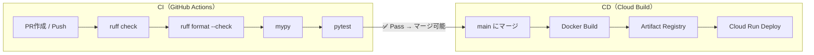

# CI/CD 構築調査

> **目的:** 既存プロジェクトにCI（継続的インテグレーション）を追加する方針の調査
> **前提:** CDは後回し。無料で構築できる手段を優先
> **更新日:** 2026-03-06

---

## 1. 現状整理

### プロジェクト構成

| ディレクトリ | 技術スタック | 状態 |
|------------|------------|------|
| `backend/` | Python 3.12 / FastAPI / SQLAlchemy / Alembic | 開発中。Dockerfile, requirements.txt あり |
| `frontend/` | React Native (iOS) | 初期段階。`src/` のみ、`package.json` 未作成 |
| `otp2/` | Java / OTP2 (経路探索サーバー) | Dockerfile で構築済み |
| `infra/` | Cloud Build YAML × 2 | CD のみ設計済み |

### 既存の CD 構成（参照: `infra/docs/CI-CDパイプライン設計.md`）

```
GitHub (main branch) → Cloud Build → Artifact Registry → Cloud Run
```

- `backend/**` 変更 → `cloudbuild-backend.yaml` → fastapi-backend デプロイ
- `otp2/**` 変更 → `cloudbuild-otp2.yaml` → otp2-server デプロイ
- トリガー: main ブランチへの push のみ

### 現状の課題

| 課題 | 詳細 |
|------|------|
| CI ステップが存在しない | lint / test / 型チェック等がない。main に直接壊れたコードが入る可能性 |
| テストが未整備 | `backend/tests/` には `__init__.py` のみ |
| `.github/workflows/` が空 | GitHub Actions 未活用 |
| frontend が未セットアップ | package.json すらない段階。CI は backend 優先 |

---

## 2. CIツール比較（無料枠前提）

### 候補一覧

| ツール | 無料枠 | 特徴 | 推奨度 |
|--------|--------|------|--------|
| **GitHub Actions** | パブリックリポ: 無制限<br>プライベート: **2,000分/月** | GitHub 統合、YAML ベース、エコシステム豊富 | ⭐⭐⭐ **推奨** |
| Cloud Build | 120分/日（無料） | 既にCDで使用中。CI追加も可能だが GitHub Actions のほうが柔軟 | ⭐⭐ |
| CircleCI | 6,000分/月（Free） | 高速だがGitHub Actions で十分 | ⭐ |
| GitLab CI | 400分/月（Free） | GitLab 移行が必要 | ✕ |

### 結論: **GitHub Actions を採用**

| 理由 | 詳細 |
|------|------|
| 無料枠が十分 | プライベートでも 2,000分/月。CI ジョブ 1回 2〜3分想定で月 600回以上実行可能 |
| GitHub 統合 | PR ステータスチェック、マージブロック等がネイティブ対応 |
| 既存CDと共存可能 | CI = GitHub Actions、CD = Cloud Build で棲み分け明確 |
| 学習コスト低 | YAML ベースでシンプル。既に `.github/workflows/` ディレクトリ準備済み |
| 公式アクション豊富 | Python セットアップ、キャッシュ等が公式で提供 |

> [!TIP]
> 既存 Cloud Build の CD はそのまま維持し、GitHub Actions で CI のみ追加する構成がもっともシンプル。

---

## 3. CI で実施すべき項目

### 3.1 backend（Python / FastAPI）

| ステップ | ツール | 目的 | 優先度 |
|---------|--------|------|--------|
| **Lint** | `ruff` | コードスタイル・バグ検出 | 🔴 高 |
| **フォーマットチェック** | `ruff format --check` | コードフォーマット統一 | 🔴 高 |
| **型チェック** | `mypy` | 型安全性の確保 | 🟡 中 |
| **ユニットテスト** | `pytest` | ロジックの正しさを保証 | 🔴 高 |
| **Dockerビルド確認** | `docker build` | Dockerfile の壊れ検知 | 🟡 中 |

> [!NOTE]
> **テストが現在ほぼ空のため**、まず CI パイプラインを構築し、テストは段階的に追加していく方針が現実的。

### 3.2 frontend（React Native）— 将来対応

frontendは `package.json` 未作成の初期段階のため、今回のCI構築スコープ外。
セットアップ後に以下を追加予定:

| ステップ | ツール | 目的 |
|---------|--------|------|
| Lint | `eslint` | コード品質 |
| フォーマット | `prettier --check` | スタイル統一 |
| 型チェック | `tsc --noEmit` | TypeScript の型検証 |
| テスト | `jest` | ユニットテスト |

### 3.3 otp2 — CI 対象外

OTP2 は Java 製のサードパーティサーバーであり、設定変更のみのため CI 対象外。

---

## 4. 推奨 CI 構成案

### パイプライン全体像

```
PR 作成 / push (main以外のブランチ含む)
    │
    └─► GitHub Actions: ci-backend.yml
          ├── Step 1: ruff check (lint)
          ├── Step 2: ruff format --check (フォーマット)
          ├── Step 3: mypy (型チェック) ← オプション
          └── Step 4: pytest (テスト)

main ブランチ merge 後
    │
    └─► Cloud Build (既存CD)
          ├── docker build
          ├── docker push → Artifact Registry
          └── gcloud run deploy → Cloud Run
```

### CI + CD フローまとめ



---

## 5. GitHub Actions ワークフロー案

### 5.1 backend CI (`ci-backend.yml`)

```yaml
name: Backend CI

on:
  push:
    branches: [main]
    paths: ['backend/**']
  pull_request:
    paths: ['backend/**']

jobs:
  lint-and-test:
    runs-on: ubuntu-latest
    defaults:
      run:
        working-directory: backend

    steps:
      - uses: actions/checkout@v4

      - name: Set up Python 3.12
        uses: actions/setup-python@v5
        with:
          python-version: '3.12'

      - name: Cache pip dependencies
        uses: actions/cache@v4
        with:
          path: ~/.cache/pip
          key: ${{ runner.os }}-pip-${{ hashFiles('backend/requirements.txt') }}
          restore-keys: |
            ${{ runner.os }}-pip-

      - name: Install dependencies
        run: |
          pip install -r requirements.txt
          pip install ruff pytest pytest-asyncio httpx mypy

      - name: Lint (ruff)
        run: ruff check .

      - name: Format check (ruff)
        run: ruff format --check .

      - name: Type check (mypy)
        run: mypy app/ --ignore-missing-imports
        continue-on-error: true  # 初期は警告のみ

      - name: Test (pytest)
        run: pytest tests/ -v
        env:
          ENVIRONMENT: test
          DATABASE_URL: sqlite+aiosqlite:///test.db
          JWT_SECRET: test-secret-key
          OTP2_GRAPHQL_URL: http://localhost:8080/otp/gtfs/v1
```

### 5.2 各ステップの補足

| ステップ | 説明 |
|---------|------|
| `ruff check` | flake8相当の高速 linter。Python 製で最速クラス |
| `ruff format --check` | black 互換のフォーマッター。`--check` で差分のみ検出 |
| `mypy` | 静的型チェック。初期は `continue-on-error: true` で警告のみ（既存コードに型注釈がない場合が多いため） |
| `pytest` | テスト実行。テスト追加に合わせて有効化 |

> [!IMPORTANT]
> **初期導入時の注意:** ruff の設定ファイル (`ruff.toml` or `pyproject.toml` の `[tool.ruff]`) を作成し、プロジェクトに合ったルールを定義すること。いきなり全ルール有効にすると大量のエラーが出る可能性がある。

---

## 6. 追加で必要な作業

### 6.1 CI 導入時に必要なファイル

| ファイル | 場所 | 目的 |
|---------|------|------|
| `ci-backend.yml` | `.github/workflows/` | GitHub Actions ワークフロー |
| `ruff.toml` or `pyproject.toml` | `backend/` | ruff のルール設定 |
| `mypy.ini` or `pyproject.toml` | `backend/` | mypy の設定（オプション） |
| `conftest.py` | `backend/tests/` | pytest 共通フィクスチャ |

### 6.2 requirements-dev.txt の作成（推奨）

本番依存 (`requirements.txt`) とは分離して開発/CI用の依存を管理:

```
# backend/requirements-dev.txt
-r requirements.txt
ruff
pytest
pytest-asyncio
httpx
mypy
aiosqlite   # テスト用の軽量 SQLite ドライバ
```

### 6.3 GitHub リポジトリ設定

| 設定項目 | 内容 |
|---------|------|
| Branch protection rule (main) | CI パス必須にする（Require status checks to pass） |
| Required status checks | `lint-and-test` ジョブを必須に設定 |

---

## 7. 段階的導入ロードマップ

### Phase 1: 最小限の CI（即時対応可能）

- [ ] `backend/requirements-dev.txt` 作成
- [ ] `backend/ruff.toml` 作成（基本ルールのみ）
- [ ] `.github/workflows/ci-backend.yml` 作成
- [ ] ruff check + ruff format --check のみ有効化
- [ ] pytest は空テストでも通るように設定

### Phase 2: テスト拡充（開発と並行）

- [ ] `backend/tests/conftest.py` にテスト用DBフィクスチャ追加
- [ ] API エンドポイントごとにテスト追加
- [ ] mypy の `continue-on-error` を外して必須化

### Phase 3: frontend CI 追加（frontend セットアップ後）

- [ ] `.github/workflows/ci-frontend.yml` 作成
- [ ] ESLint + Prettier + Jest の設定

### Phase 4: CD の改善（将来）

- [ ] ステージング環境の追加
- [ ] E2E テストの導入
- [ ] Cloud Build 側に CI ステップ追加（Docker ビルド前にテスト実行）

---

## 8. コスト見積もり

| 項目 | 料金 | 備考 |
|------|------|------|
| GitHub Actions | **$0** | パブリックリポ: 無制限。プライベート: 2,000分/月の無料枠 |
| Cloud Build (既存CD) | **$0** | 120分/日の無料枠内 |
| **合計** | **$0/月** | 無料枠内で運用可能 |

> [!NOTE]
> プライベートリポジトリでも、CI ジョブ 1回あたり約 2〜3分 × 月 600回以上の実行が無料枠内で収まる。ハッカソン規模では全く問題なし。

---

## 9. 参照ドキュメント

| ドキュメント | パス |
|------------|------|
| CI/CDパイプライン設計 | `infra/docs/CI-CDパイプライン設計.md` |
| アーキテクチャ図 | `infra/docs/アーキテクチャ図.md` |
| API仕様 | `backend/app/api/api仕様.md` |
| データモデル | `backend/docs/spec/データモデル.md` |
| docker-compose.yml | `docker-compose.yml` |
| Dockerfile (backend) | `backend/Dockerfile` |
| cloudbuild-backend.yaml | `infra/cloudbuild-backend.yaml` |
| cloudbuild-otp2.yaml | `infra/cloudbuild-otp2.yaml` |
