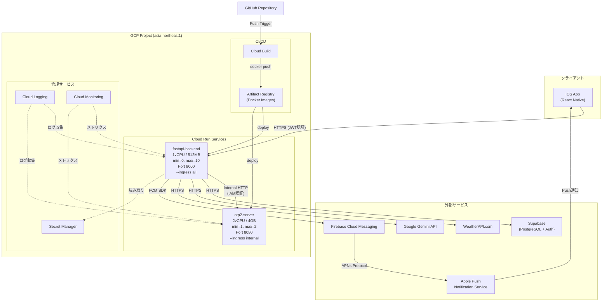
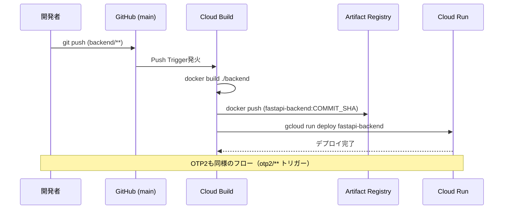
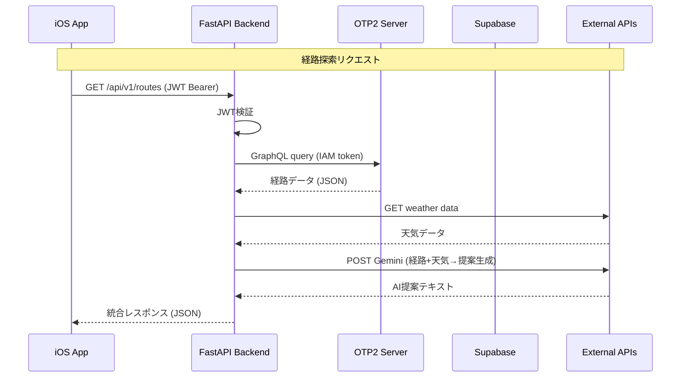
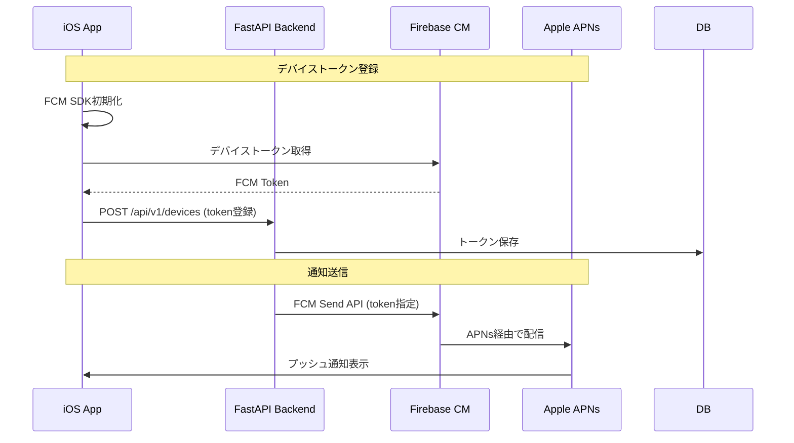

# アーキテクチャ図

> **構成:** 案A — Cloud Run マルチサービス構成（確定）
> **クライアント:** iOS アプリ（React Native）
> **更新日:** 2026-03-05

---

## 1. システム全体構成図



---

## 2. ASCII ダイアグラム

Mermaid非対応環境向けのテキスト図。

```
                    ┌──────────────────┐
                    │   iOS App        │
                    │  (React Native)  │
                    └────────┬─────────┘
                             │ HTTPS (JWT認証)
                             ▼
┌────────────────────────────────────────────────────────┐
│                  GCP Project (asia-northeast1)          │
│                                                         │
│  ┌───────────────┐     ┌────────────────────────────┐  │
│  │ Cloud Build    │◄────│ GitHub (Push Trigger)       │  │
│  │ (CI/CD)        │     └────────────────────────────┘  │
│  └──────┬────────┘                                      │
│         │ Build & Deploy                                │
│         ▼                                               │
│  ┌──────────────────┐                                   │
│  │ Artifact Registry │                                   │
│  │ (Docker Images)   │                                   │
│  └──────┬───────────┘                                   │
│         │                                               │
│  ┌──────┴───────────────────────────────────────────┐  │
│  │              Cloud Run Services                   │  │
│  │                                                    │  │
│  │  ┌─────────────────────┐  ┌────────────────────┐ │  │
│  │  │ fastapi-backend      │  │ otp2-server        │ │  │
│  │  │ (min=0, max=10)      │  │ (min=1, max=2)     │ │  │
│  │  │ 1vCPU / 512MB        │  │ 2vCPU / 4GB        │ │  │
│  │  │ Port: 8000           │  │ Port: 8080         │ │  │
│  │  │ 公開 (ingress all)   │  │ 内部のみ (internal)│ │  │
│  │  └──────────┬───────────┘  └──────▲─────────────┘ │  │
│  │             │   Internal HTTP      │               │  │
│  │             │   (IAM認証)          │               │  │
│  │             └──────────────────────┘               │  │
│  └────────────────────────────────────────────────────┘  │
│                                                         │
│  ┌──────────────┐  ┌──────────────┐  ┌──────────────┐  │
│  │ Secret Mgr   │  │ Cloud        │  │ Cloud        │  │
│  │ (API Keys)   │  │ Logging      │  │ Monitoring   │  │
│  └──────────────┘  └──────────────┘  └──────────────┘  │
└────────────────────────────────────────────────────────┘
         │                    │               │
         ▼                    ▼               ▼
  ┌──────────────┐   ┌──────────────┐  ┌─────────────┐
  │ Supabase     │   │ WeatherAPI   │  │ Gemini API  │
  │ (PostgreSQL) │   │              │  │             │
  └──────────────┘   └──────────────┘  └─────────────┘
```

---

## 3. デプロイフロー図



```
GitHub Push (main branch)
    │
    ├─► Cloud Build Trigger (backend/**)
    │     1. docker build fastapi-backend
    │     2. push to Artifact Registry
    │     3. gcloud run deploy fastapi-backend
    │
    └─► Cloud Build Trigger (otp2/**)
          1. docker build otp2-server (graph.obj込み, ~1GB)
          2. push to Artifact Registry
          3. gcloud run deploy otp2-server

※ iOS アプリは Xcode / EAS Build で管理（GCP CI/CD対象外）
```

---

## 4. データフロー図



---

## 5. プッシュ通知フロー図



---

## 6. サービス仕様サマリー

| サービス | 実行環境 | CPU / Memory | インスタンス | 公開範囲 | ポート |
|---------|---------|------------|------------|---------|-------|
| fastapi-backend | Cloud Run | 1 vCPU / 512MB | 0〜10 | 外部公開 (HTTPS) | 8000 |
| otp2-server | Cloud Run | 2 vCPU / 4GB | 1〜2 | 内部のみ | 8080 |

## 7. コスト見積もり（月額）

| 項目 | 料金 | 備考 |
|------|------|------|
| Cloud Run (FastAPI) | ~$0 | 無料枠内（200万リクエスト/月） |
| Cloud Run (OTP2, min=1) | ~$30-50 | 4GB RAM × 1インスタンス常時起動 |
| Artifact Registry | ~$1 | ストレージ料金のみ |
| Cloud Build | ~$0 | 120分/日の無料枠内 |
| Secret Manager | ~$0 | 少数のシークレット |
| **合計** | **~$30-50/月** | Firebase Hosting不要で削減 |
